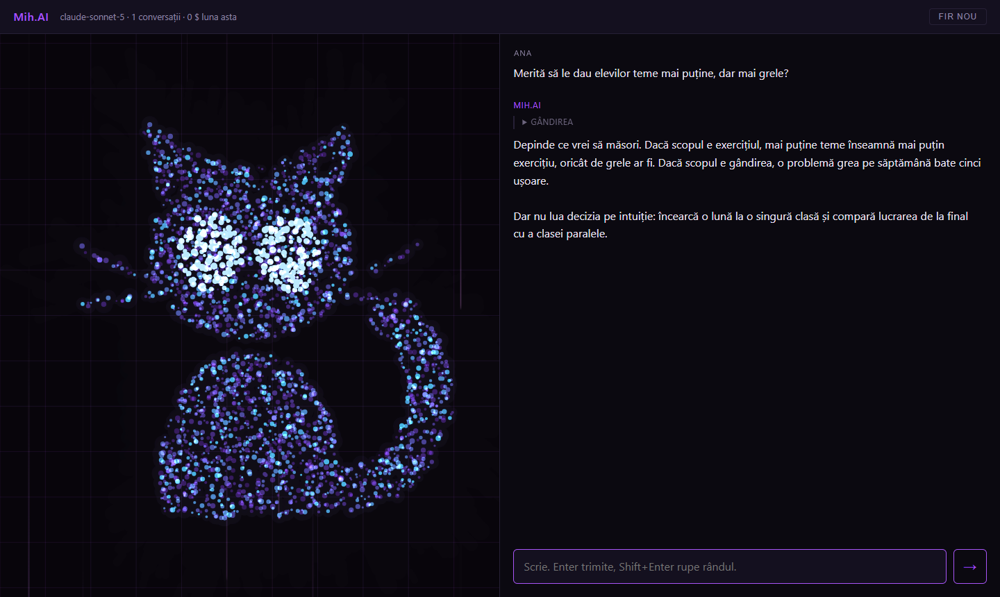
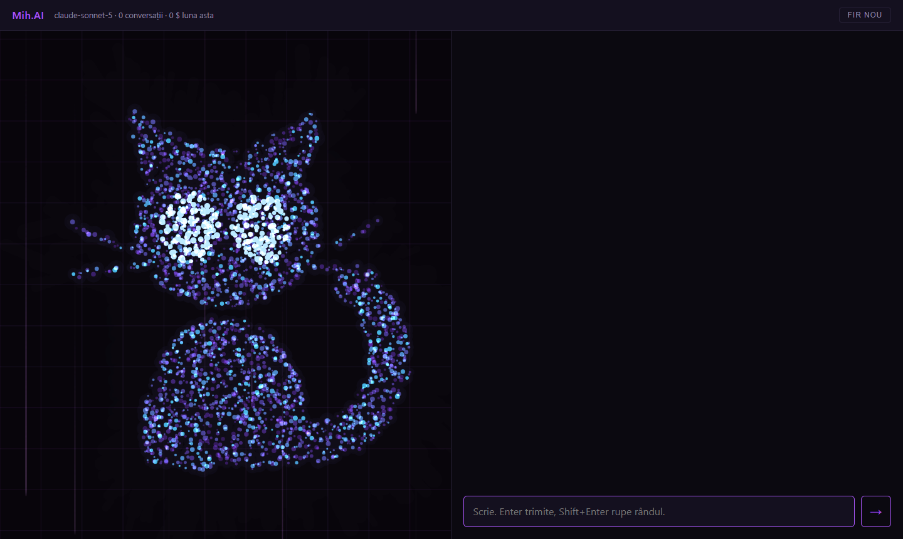

# Mih.AI — a personal digital twin

Mih.AI is a small local web app where you talk — by keyboard or by voice — with a language
model prompted from one person's own writing. It does two things: it talks *with* its author,
as a thinking partner that is expected to push back, and *as* the author, to others, always
saying that it is the twin. Speech-to-text and text-to-speech run on the machine; only the
model call goes out, to the Anthropic API, and every paid call is logged with the exact token
usage the API reported.

**The persona in this repository is fictional.** "Ana Ionescu", a physics teacher, does not
exist: the files under `persona/` show the shape of the prompt without anyone's personal data.
To build your own twin, you rewrite them from your own texts.

Code comments, the user interface and the persona are in Romanian.

**Related project:** [Iris](https://github.com/Mihai-Streanga/Iris-public) — the author's
always-on-top dictation window. When the Mih.AI page takes focus, the server puts the Iris
window back on top without stealing focus (`server/fereastra.py`).

## Screenshots



*Left: the "face", a particle cloud that changes colour and motion with the program's state;
it is also the microphone button. Right: the conversation. The reply in this picture comes
from a **simulated model** — a stand-in for the API call, used only to take the picture — and
the persona is the fictional one. The page was rendered by headless Edge from a fresh clone,
on port 8199; the speaker label was then retouched to "Ana", the name the copy uses now.*



*The page right after start, with no API key set: the status bar shows the model, the number
of saved conversations and this month's spend.*

## How it works

- **The system prompt is built from files, in alphabetical order** (`server/prompt.py`):
  `persona/prompt/00-cadru.md` (who the twin is), `10-sine.md` (what the person is part of),
  `20-partener.md` (how the twin behaves as a partner), `30-stil.md` (how it sounds), then an
  evidence file (`persona/probe/dosar.md`, a source on every line), then whole texts written
  by the person (`persona/probe/exemple/`). HTML comments are notes for whoever edits the
  files and are stripped before anything is sent.
- **Two kinds of knowledge.** What the model knows, the twin may use freely. What the person
  lived, decided or believes, only with a source in the files above.
- **Style is written from evidence, not from self-description**: real texts beat rules about
  them.
- **A blind test bank** (`persona/banc-orb/`) holds questions the person answers on their own;
  it never enters the prompt. `compune()` takes no path argument, so there is no parameter
  through which the bank could leak in.
- **Cost is measured, not estimated.** Each call appends the API's `usage` to
  `date/consum/YYYY-MM.jsonl`, even when the reply is interrupted (it was paid for anyway).
  The prompt and the conversation are cached (5-minute TTL), so a long conversation is not
  re-billed at full input price on every turn.
- **Listening is guarded against hallucination.** Silence, noise and coughs never reach the
  paid model: an energy gate, Silero VAD, an alphabet check, a words-per-second check and a
  trim of YouTube-style closing lines ("thanks for watching") that Whisper adds to silence.
  Why each net exists, and the measurements behind the ear and the voice, are in
  [`docs/DESIGN.md`](docs/DESIGN.md).

## Tech stack

| layer | what |
|---|---|
| server | Python 3.14, FastAPI, uvicorn |
| model | Anthropic API, `claude-sonnet-5`, streaming, adaptive thinking (shown folded in the page), prompt caching |
| speech-to-text | Whisper large-v3-turbo (int8) on OpenVINO GenAI — Intel integrated GPU, CPU fallback; Silero VAD from `faster-whisper` |
| text-to-speech | Piper with the Romanian voice *Liana*; espeak-ng phonemizer loaded through `ctypes` |
| page | plain HTML, CSS and JavaScript modules, no build step; `AudioWorklet` for the microphone, canvas for the face |
| tests | plain Python scripts, no pytest |

## Installation

Windows 11 and Python 3.14. An Intel integrated GPU makes transcription fast; without one it
runs on the CPU, six to nine times slower. Window management (ESC to minimise, keeping Iris
on top) uses the Windows API and does nothing elsewhere.

```
git clone https://github.com/Mihai-Streanga/DigitalTwin-public.git
cd DigitalTwin-public
py -m venv .venv
.venv\Scripts\activate
python -m pip install -r requirements.txt
```

**The Whisper model**, once, into the HuggingFace cache of your user (about 0.8 GB):

```
python -c "from huggingface_hub import snapshot_download; snapshot_download('OpenVINO/whisper-large-v3-turbo-int8-ov')"
```

**The voice**, once. `modele/` is not versioned; this downloads the Liana voice (114 MB),
its patched espeak dictionary into a local copy of the espeak data, and `espeak-ng.dll` from
the `espeakng-loader` wheel:

```
python scripts/adu-vocea.py
```

It ends with `weekend -> wˈikend (bun)`. If it prints `wˌeekˈend`, the patched dictionary
did not land where it should.

Why the DLL: on machines with **Smart App Control** enabled, Windows blocks the unsigned
`espeakbridge.pyd` shipped with `piper-tts`. `server/espeak_ctypes.py` replaces it with the
same three functions over `espeak-ng.dll`, which passes the policy. Without Smart App Control
the original bridge loads and the replacement is never used.

**The API key**, as a user environment variable, then open a new terminal:

```
setx ANTHROPIC_API_KEY "your-key"
```

The server does not read a `.env` file; `.env.example` only documents the variable.

## Usage

Double-click `porneste.vbs`: it starts the server with no console window and opens the page
in its own Chrome or Edge window (`--app`, maximised). Or, to see the server log:

```
python -m uvicorn server.app:aplicatie --port 8100
```

and open `http://localhost:8100`.

- Type and press Enter, or **click the face** to open the microphone: speak, pause for two
  seconds, and the sentence is sent. While the microphone is open, replies are also spoken.
  A second click closes the microphone and cuts off the voice.
- **ESC** minimises the window. **"fir nou"** starts an empty conversation.
- `http://localhost:8100/?ureche=auto` opens the microphone without a click, once the browser
  has the permission.

Example output, from a fresh clone with no API key, on port 8199 (the reference sentence is
a recording of the Liana voice; "Mih.AI" is pronounced "Mihai"):

```
$ curl http://localhost:8199/api/viu
{"viu":true}

$ curl http://localhost:8199/api/stare
{"model":"claude-sonnet-5","prompt":"6 fisiere: 00-cadru, 10-sine, 20-partener, 30-stil, dosar, scrisoare-catre-parinti","conversatii":1,"consum_luna_dolari":0.0,"consum_randuri_stricate":0,"fire_deschise":0,"ureche":true,"ureche_dispozitiv":"GPU"}

$ curl -X POST http://localhost:8199/api/transcrie --data-binary @tests/date/liana-16k.wav
{"text":"Astăzi verificăm dacă Mihai mai vorbește și mai aude înainte de actualizare.","secunde":0.61,"durata_audio":4.35,"vorbire":4.35}

$ curl -X POST http://localhost:8199/api/mesaj -H "Content-Type: application/json" -d "{\"id\": \"2026-10-04_213144\", \"text\": \"Salut\"}"
event: eroare
data: {"text": "RuntimeError: ANTHROPIC_API_KEY lipseste din mediu. Serverul nu porneste apeluri fara ea."}

event: gata
data: {}
```

`/api/mesaj` streams Server-Sent Events: `text` and `gand` (the folded thinking) while the
model writes, `eroare` when something breaks, `gata` at the end.

## Configuration

| what | where |
|---|---|
| API key | `ANTHROPIC_API_KEY`, environment variable |
| model, output cap, thinking effort, cache TTL | `server/model.py`: `MODEL`, `MAX_TOKENI`, `EFORT`, `CACHE_TTL` |
| prices and monthly budget, for the spend counter | `scripts/consum-api.py`: `PRETURI`, `BUGET` |
| microphone thresholds (silence, volume, minimum speech) | `server/web/pagina.js`, the `praguri` object — the only place they are set |
| what Whisper is told to expect | `server/transcriere.py`: `CONTEXT` |
| voice and pronunciation fixes | `server/voce.py`: `VOCE`, `JARGON`, `NUME` |
| the speaker's name in the page and in the saved conversations | `server/web/pagina.js` and `server/jurnal.py` ("Ana", the fictional persona) |
| the persona | `persona/` |

What the program writes, all under `date/` (ignored by git): conversations as Markdown in
`date/conversatii/`, the spend log in `date/consum/`, and `date/ureche.log`, one line per
utterance with the verdict of the listening filters.

`python scripts/consum-api.py` prints this month's spend from the log.

## Tests

```
python tests/ruleaza.py
```

No test calls the paid API. The suite checks the cost arithmetic two independent ways, the
HTTP contract of every free route (including the Host/Origin checks that keep other websites
away from the local server), and a real start: it launches the server on port 8199, waits
for the speech engine to get ready on its own, and transcribes a reference sentence.

Tests are **skipped, with the reason**, when their input is missing: the real spend logs
(they are never in the repository) and, without the Whisper model, the two speech tests.

The start test runs a real server, so it leaves `date/ureche.log` and
`tmp-proba-pornire.log` behind. Both are ignored by git; delete them before copying the
folder anywhere by hand.

Output from a fresh clone, in a new virtual environment built only from `requirements.txt`:

```
SARIT  cost: registrele reale — date/consum/ lipsește — sărit
OK    cost: recalcul consum-stricat.jsonl — pe rânduri 0.067849 $, pe categorii 0.067849 $
OK    cost: registrul stricat, citit — apeluri 3, stricate [2], necunoscute ['claude-necunoscut-9']
OK    cost: registrul stricat, spus de unealtă — cod 2
OK    http: GET / dă pagina — 200
OK    http: GET /api/viu — {"viu":true}
OK    http: GET /api/stare are cheile paginii
OK    http: GET /api/conversatie-noua dă un id valid — {"id":"2026-10-04_213206"}
OK    http: POST /api/mesaj cu id invalid: eroare, fără apel — event: eroare | data: {"text": "id de conversatie invalid"}
OK    http: POST /api/mesaj fără cheie: o singură eroare, cu motivul — event: eroare | data: {"text": "RuntimeError: ANTHROPIC_API_KEY lipseste din mediu. Serverul nu porneste apeluri fara ea
OK    http: POST /api/vorbeste cu text gol: 400 — {"eroare":"text gol"}
OK    http: POST /api/transcrie cu corp gol: 400 — {"eroare":"corp gol"}
OK    http: POST /api/transcrie pe 8 kHz: 500 cu motivul — {"eroare":"ValueError: astept 16000 Hz, am primit 8000"}
OK    http: POST /api/transcrie pe 8 biți: 500 cu motivul — {"eroare":"ValueError: astept PCM pe 16 biti, am primit 8"}
OK    http: margine: Host străin → 403 — {"eroare":"Host strain: 'evil.example:8100'"}
OK    http: margine: pagina rămâne deschisă — 200
OK    http: margine: POST cu Origin străin → 403 — {"eroare":"Origin strain: 'http://evil.example'"}
OK    http: margine: POST cu Origin pe alt port → 403 — {"eroare":"Origin strain: 'http://localhost:9999'"}
OK    http: margine: POST cu Origin propriu trece — {"eroare":"text gol"}
OK    http: margine: 127.0.0.1 trece — 200
OK    pornire: /api/viu răspunde — 3.4 s
OK    pornire: urechea gata singură, fără clic — 7.6 s de la pornire, pe GPU
OK    ureche: reperul transcris exact — „Astăzi verificăm dacă Mihai mai vorbește și mai aude înainte de actualizare.”

22 trecute, 0 căzute, 1 sărite — 9.7 s
```

What does not work without real resources: with no API key, every reply fails with the
message above (the page and the speech features still work); with no Whisper model, the
microphone cannot start and the two speech tests are skipped; with no voice
(`scripts/adu-vocea.py` not run), replies are not spoken, and with the microphone open the
face shows the voice error under it.

## Performance

Measured on an ASUS Vivobook S 16 — Intel Core Ultra 7 255H, Intel Arc 140T integrated GPU,
32 GB RAM, Windows 11:

| step | time |
|---|---|
| Whisper on the GPU, utterances of 1.8 / 7.1 / 13.7 s | 0.25 / 0.36 / 0.55 s |
| the same on the CPU | 2.28 / 2.44 / 2.87 s |
| speech engine compile, with / without the OpenVINO cache | 0.8 s / 3.2–4.7 s |
| voice, first sound of a sentence after warm-up | 0.47–0.74 s |

## Known limitations

- **Tested only on Windows 11.** The server would start elsewhere, but `porneste.vbs`, the
  window management and the Smart App Control workaround are Windows-specific.
- **The voice is non-commercial** (CC-BY-NC-4.0). For commercial use, replace it in
  `server/voce.py`.
- **Romanian only**: Whisper is forced to Romanian, and the voice and its pronunciation fixes
  are Romanian.
- **Written for one person**: the speaker label is fixed in the code ("Ana" here), and the
  voice says "Mih.AI" as "Mihai".
- **The conversation lives in memory.** Restarting the server ends it, by design; the text is
  already saved after every exchange.
- **No authentication.** The server listens on `127.0.0.1` only and rejects requests whose
  Host or Origin is not local.
- **Prices are written in the code** and were last checked on 3 September 2026.

## License

MIT © 2026 Mihai Streanga — see `LICENSE`. Components downloaded during installation keep their
own licenses and are not redistributed here; the Romanian voice is non-commercial. The table
is in `NOTICE.md` (in Romanian).

Built by Mihai Streanga, together with Claude (Anthropic).
